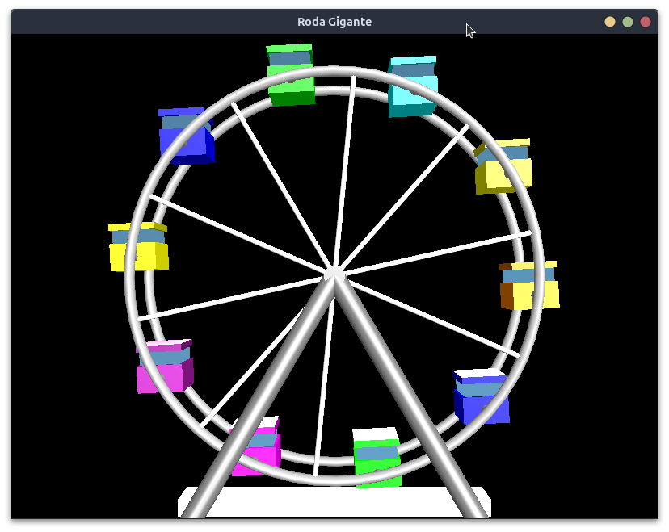

# Modelagem 3D com OpenGL de uma roda gigante animada 🎡

Trabalho de conclusão da disciplina Computação Gráfica do 7º período em Ciência da Computação.



## Objetivos
Desenvolver um modelo hierárquico utilizando C/C++
com OpenGL e Glut para representar uma roda gigante simplificada. O modelo deve
incluir cabines e aros, possibilitar controle da velocidade de rotação da roda gigante
e permitir que cada cabine também se movimente.
Além disso, deve implementar funções para movimentação da câmera
ao redor da roda gigante, possibilitando aproximação, afastamento e rotação em
torno do modelo. A cena deve conter efeitos de iluminação, atribuindo cores
diferentes para cada cabine e um efeito metálico para as hastes da roda gigante.

## Tecnologias utilizadas 🤖
- [C++](https://isocpp.org/)
- [OpenGL](https://www.opengl.org/)
- [Make](https://www.gnu.org/software/make/manual/make.html)

## Bibliotecas 
- [math](https://cplusplus.com/reference/cmath/)
- [glut](https://www.opengl.org/resources/libraries/glut/glut_downloads.php)

## Execução

Para executar o código use o comando:
```make run```